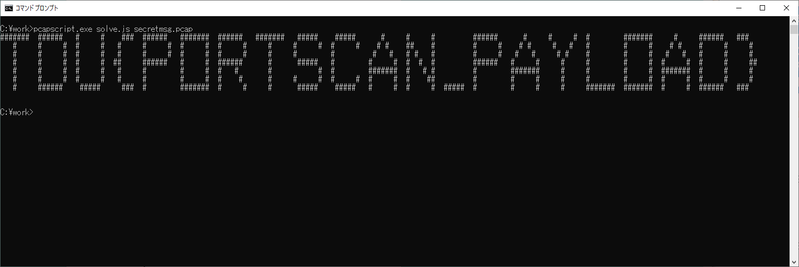

# CTF の問題を PCAPScript で解いてみる

## TDUCTF 2015 "Portscan"

問題：ポートスキャンが仕掛けられた！ん？何かメッセージがついてきているぞ？

https://ctf.mzyy94.com/q/TDUCTF2015-NW500/

----

## (1) 記録されている通信の概観

UDP,TCP,ICMP のパケットをダンプしてみる。

```javascript
// dump.js

function UDP(n, udp, ip, eth) {
    console.log("#"+n, "[UDP]", ipaddr(ip.SrcIP)+":"+udp.SrcPort, "->", 
        ipaddr(ip.DstIP) + ":" + udp.DstPort);
    if (udp.Payload.length>0) {
        console.log(hex(udp.Payload));
    }
}

function TCP(n, tcp, ip, eth) {
    console.log("#"+n, "[TCP]", ipaddr(ip.SrcIP) +":"+ tcp.SrcPort, "->", 
        ipaddr(ip.DstIP) + ":" + tcp.DstPort);
    console.log("\tSeq:", tcp.Seq, "Ack:", tcp.Ack);
    var flags = [];
    if (tcp.SYN) {
        flags.push("SYN");
    }
    if (tcp.ACK) {
        flags.push("ACK");
    }
    if (tcp.PSH) {
        flags.push("PSH");
    }
    if (tcp.FIN) {
        flags.push("FIN");
    }
    console.log("\tFlags:", flags.join(","));
    if (tcp.Payload.length>0) {
        console.log(hex(tcp.Payload));
    }
}

function ICMP(n, icmp, ip, eth) {
    console.log("#"+n, "[ICMPv4]", ipaddr(ip.SrcIP), "->", ipaddr(ip.DstIP));
    console.log("TypeCode:", icmp.TypeCode);
    if (icmp.Payload.length > 0) {
        console.log(hex(icmp.Payload));
    }
}
```

```
C:\work> pcapscript dump.js secretmsg.pcap > reult1.txt
```

[result1.txt](result1.txt):
```
#0 [UDP] 192.168.100.60:1024 -> 192.168.0.238:1
00000000  23                                                |#|

#1 [ICMPv4] 192.168.0.238 -> 192.168.100.60
TypeCode: 771
00000000  45 00 00 1d 01 0a 00 00  40 11 93 4b c0 a8 64 3c  |E.......@..K..d<|
00000010  c0 a8 00 ee 04 00 00 01  00 09 00 00              |............|

#2 [UDP] 192.168.100.60:1025 -> 192.168.0.238:2
00000000  23                                                |#|

#3 [ICMPv4] 192.168.0.238 -> 192.168.100.60
TypeCode: 771
00000000  45 00 00 1d 99 18 00 00  40 11 fb 3c c0 a8 64 3c  |E.......@..<..d<|
00000010  c0 a8 00 ee 04 01 00 02  00 09 00 00              |............|

(*SNIP*)
```

わかったこと：

* 192.168.100.60 から 192.168.0.238 に対して UDP でポート番号 1 ～ 1288 に対してスキャンを行なっている。
* TCP ではスキャンは行なっていない。
* ポートが閉じている場合には 192.168.0.238 から 192.168.100.60 に対して ICMP で TypeCode = 0x0303 (宛先到達不可能通知・ポート到達不能) のパケットを送信している。 
* ICMP パケットのペイロードを確認するとポートスキャンに使われた UDP パケットのヘッダが格納されている。
  |オフセット|内容|
  |:---:|:---|
  |12-15|送信元アドレス|
  |16-19|送信先アドレス|
  |20-21|送信元ポート番号|
  |22-23|送信先ポート番号|

----

## (2) オープンポートの確認

ポートが閉じている場合には ICMP で TypeCode = 0x0303 のパケットが返送されることに注目する。

```javascript
// portscan.js

// スキャンしたポート番号を格納する変数
var scaned = {};

// END は最後に実行される
function END(count) {
    // オープンしているポート番号のリストを取得
    var ports = [];
    for (k in scaned) {
        //console.log(k+":", scaned[k]);
        if (scaned[k] == "open?") {
          ports.push(k);
        }
    }

    console.log("open ports:", ports.join(","));
}

function UDP(n, udp, ip, eth) {
    // スキャンしたポート番号を記録。
    scaned[udp.DstPort] = "open?";
}

function ICMP(n, icmp, ip, eth) {
    // TypeCode == 0x0303 は宛先到達不可能通知でポート到達不能の場合
    if (icmp.TypeCode == 0x0303 && icmp.Payload.length > 0) {
        // スキャンしたポート番号はペイロードの 22,23 番目の2バイト。
        var port = icmp.Payload[22]*256 + icmp.Payload[23];
        // スキャンしたポート番号が閉じていることを記録。
        scaned[port] = "close";
    }
}
```

```
C:\work> pcapscript portscan.js secretmsg.pcap
open ports: 123,137,138,500
```

わかったこと：

* オープンなポート(UDP)は 123,137,138,500。各ポートの想定サービスは以下の通り。
  |オープンポート(UDP)|想定されるサービス|
  |:---|:---|
  |123|NTP|
  |137|NetBIOS Name Service|
  |138|NetBIOS Datagram Service|
  |500|ISAKMP|
* ただし、これらの情報はフラグにはつながらなさそう。

----

## (3) UDPのペイロード確認

[result1.txt](result1.txt) の UDP のペイロードに出現するバイトデータの出現回数を確認する。

```javascript
// udpcount.js

var bytes = {};
function add(b) {
    if (bytes[b] == undefined) {
        bytes[b] = 0;
    }
    bytes[b] = bytes[b] + 1;
}
function END(count) {
    for (k in bytes) {
        console.log(k + ":", bytes[k]);
    }
}

function UDP(n, udp, ip, eth) {
    if (udp.Payload.length>0) {
        for (i in udp.Payload) {
            add(udp.Payload[i]);
        }
    }
}
```
```
C:\work> pcapscript udpcount.js secretmsg.pcap
35: 358
32: 923
10: 7
```

わかったこと：

* UDP のペイロードに出現するバイトは 35,32,10 の 3 種類でありそれぞれの出現回数とそれをアスキーコードとする文字は以下の通り。
  |10進数|出現回数|16進数|文字|
  |:---:|---:|:---:|:---:|
  |35|357回|0x23|シャープ("#")|
  |32|923回|0x20|空白(" ")|
  |10|7回|0x0a|改行(LF)|

----

## (4) UDPのペイロード確認2

UDP のペイロードに出現するバイトはすべてアスキーコードになる。すべてを並べると文章になっていると推測。

```javascript
// solve.js

var msg=[];

function END(count) {
    // 最後にバイト列を文字列に変換して表示
    console.log(str(msg));
}

function UDP(n, udp, ip, eth) {
    if (udp.Payload.length>0) {
        // ペイロードのバイト列を変数 msg に結合して格納
        msg = msg.concat(udp.Payload);
    }
}
```



フラグのバナーが表示される。

したがってフラグは以下の通り。

フラグ：TDU{PORTSCAN_PAYLOAD}
