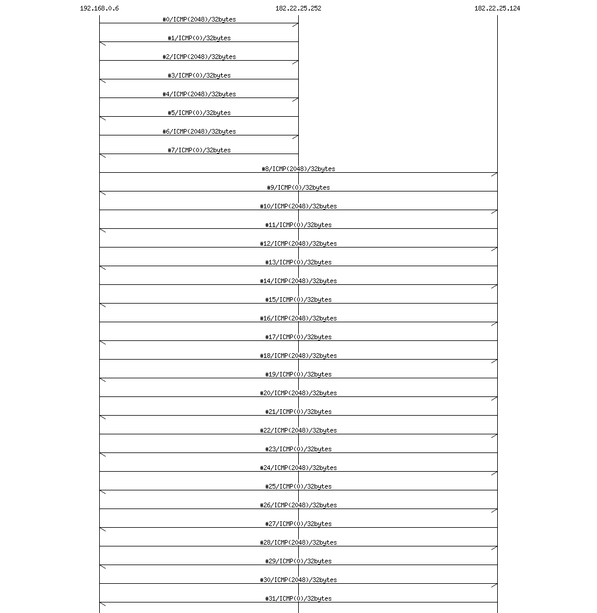

# PCAPScript を使って CTF の問題を解いてみる

2020/09/25 開催の「ゼロから始めるCTF入門」の佐伯さんの講義「パケットを読み解く第一歩」で紹介された問題を PCAPScript を使って解いてみる。

[icmp.pcap](icmp.7z)

## MSC

[msc.js](msc.js) と [Mscgen](http://www.mcternan.me.uk/mscgen/) を用いて icmp.pcap の中でやりとりされるメッセージシーケンスチャートを抽出し、記録されている通信の概要を把握する。 

```
C:\work> pcapscript msc.js icmp.pcap > msc.txt
C:\work> mscgen -T png -o msc.png msc.txt
```

msc.png:



わかったこと：

* #0 ～ #7 は 192.168.0.6 と 182.22.25.252 の間、#8 ～ #31 は 192.168.0.6 と 182.22.25.124 の間の ICMP のやりとりが行われている。
* 使われているのは ICMP のみで TCP や UDP などは使われていない。

----

## Payload

ICMP でやりとりされるペイロードを確認してみる。

```
// payload.js

function ICMP(n, icmp, ip, eth) {
  console.log("#"+n, ipaddr(ip.SrcIP), "->", ipaddr(ip.DstIP), "TypeCode:"+icmp.TypeCode);
  // ペイロードがあるときのみ HEX 表示する。
  if (icmp.Payload.length > 0) {
    console.log(hex(icmp.Payload));
  }
}
```

```
C:\work> pcapscript payload.js icmp.pcap > result.txt
```

result.txt:

```
#0 192.168.0.6 -> 182.22.25.252 TypeCode:2048
00000000  66 62 63 64 65 66 67 68  69 6a 6b 6c 6d 6e 6f 70  |fbcdefghijklmnop|
00000010  71 72 73 74 75 76 77 61  62 63 64 65 66 67 68 69  |qrstuvwabcdefghi|

#1 182.22.25.252 -> 192.168.0.6 TypeCode:0
00000000  66 62 63 64 65 66 67 68  69 6a 6b 6c 6d 6e 6f 70  |fbcdefghijklmnop|
00000010  71 72 73 74 75 76 77 61  62 63 64 65 66 67 68 69  |qrstuvwabcdefghi|

#2 192.168.0.6 -> 182.22.25.252 TypeCode:2048
00000000  6c 62 63 64 65 66 67 68  69 6a 6b 6c 6d 6e 6f 70  |lbcdefghijklmnop|
00000010  71 72 73 74 75 76 77 61  62 63 64 65 66 67 68 69  |qrstuvwabcdefghi|

#3 182.22.25.252 -> 192.168.0.6 TypeCode:0
00000000  6c 62 63 64 65 66 67 68  69 6a 6b 6c 6d 6e 6f 70  |lbcdefghijklmnop|
00000010  71 72 73 74 75 76 77 61  62 63 64 65 66 67 68 69  |qrstuvwabcdefghi|

#4 192.168.0.6 -> 182.22.25.252 TypeCode:2048
00000000  61 62 63 64 65 66 67 68  69 6a 6b 6c 6d 6e 6f 70  |abcdefghijklmnop|
00000010  71 72 73 74 75 76 77 61  62 63 64 65 66 67 68 69  |qrstuvwabcdefghi|

#5 182.22.25.252 -> 192.168.0.6 TypeCode:0
00000000  61 62 63 64 65 66 67 68  69 6a 6b 6c 6d 6e 6f 70  |abcdefghijklmnop|
00000010  71 72 73 74 75 76 77 61  62 63 64 65 66 67 68 69  |qrstuvwabcdefghi|

#6 192.168.0.6 -> 182.22.25.252 TypeCode:2048
00000000  67 62 63 64 65 66 67 68  69 6a 6b 6c 6d 6e 6f 70  |gbcdefghijklmnop|
00000010  71 72 73 74 75 76 77 61  62 63 64 65 66 67 68 69  |qrstuvwabcdefghi|

#7 182.22.25.252 -> 192.168.0.6 TypeCode:0
00000000  67 62 63 64 65 66 67 68  69 6a 6b 6c 6d 6e 6f 70  |gbcdefghijklmnop|
00000010  71 72 73 74 75 76 77 61  62 63 64 65 66 67 68 69  |qrstuvwabcdefghi|

#8 192.168.0.6 -> 182.22.25.124 TypeCode:2048
00000000  7b 62 63 64 65 66 67 68  69 6a 6b 6c 6d 6e 6f 70  |{bcdefghijklmnop|
00000010  71 72 73 74 75 76 77 61  62 63 64 65 66 67 68 69  |qrstuvwabcdefghi|

#9 182.22.25.124 -> 192.168.0.6 TypeCode:0
00000000  7b 62 63 64 65 66 67 68  69 6a 6b 6c 6d 6e 6f 70  |{bcdefghijklmnop|
00000010  71 72 73 74 75 76 77 61  62 63 64 65 66 67 68 69  |qrstuvwabcdefghi|

#10 192.168.0.6 -> 182.22.25.124 TypeCode:2048
00000000  7a 62 63 64 65 66 67 68  69 6a 6b 6c 6d 6e 6f 70  |zbcdefghijklmnop|
00000010  71 72 73 74 75 76 77 61  62 63 64 65 66 67 68 69  |qrstuvwabcdefghi|

#11 182.22.25.124 -> 192.168.0.6 TypeCode:0
00000000  7a 62 63 64 65 66 67 68  69 6a 6b 6c 6d 6e 6f 70  |zbcdefghijklmnop|
00000010  71 72 73 74 75 76 77 61  62 63 64 65 66 67 68 69  |qrstuvwabcdefghi|

#12 192.168.0.6 -> 182.22.25.124 TypeCode:2048
00000000  65 62 63 64 65 66 67 68  69 6a 6b 6c 6d 6e 6f 70  |ebcdefghijklmnop|
00000010  71 72 73 74 75 76 77 61  62 63 64 65 66 67 68 69  |qrstuvwabcdefghi|

#13 182.22.25.124 -> 192.168.0.6 TypeCode:0
00000000  65 62 63 64 65 66 67 68  69 6a 6b 6c 6d 6e 6f 70  |ebcdefghijklmnop|
00000010  71 72 73 74 75 76 77 61  62 63 64 65 66 67 68 69  |qrstuvwabcdefghi|

#14 192.168.0.6 -> 182.22.25.124 TypeCode:2048
00000000  72 62 63 64 65 66 67 68  69 6a 6b 6c 6d 6e 6f 70  |rbcdefghijklmnop|
00000010  71 72 73 74 75 76 77 61  62 63 64 65 66 67 68 69  |qrstuvwabcdefghi|

#15 182.22.25.124 -> 192.168.0.6 TypeCode:0
00000000  72 62 63 64 65 66 67 68  69 6a 6b 6c 6d 6e 6f 70  |rbcdefghijklmnop|
00000010  71 72 73 74 75 76 77 61  62 63 64 65 66 67 68 69  |qrstuvwabcdefghi|

#16 192.168.0.6 -> 182.22.25.124 TypeCode:2048
00000000  6f 62 63 64 65 66 67 68  69 6a 6b 6c 6d 6e 6f 70  |obcdefghijklmnop|
00000010  71 72 73 74 75 76 77 61  62 63 64 65 66 67 68 69  |qrstuvwabcdefghi|

#17 182.22.25.124 -> 192.168.0.6 TypeCode:0
00000000  6f 62 63 64 65 66 67 68  69 6a 6b 6c 6d 6e 6f 70  |obcdefghijklmnop|
00000010  71 72 73 74 75 76 77 61  62 63 64 65 66 67 68 69  |qrstuvwabcdefghi|

#18 192.168.0.6 -> 182.22.25.124 TypeCode:2048
00000000  6b 62 63 64 65 66 67 68  69 6a 6b 6c 6d 6e 6f 70  |kbcdefghijklmnop|
00000010  71 72 73 74 75 76 77 61  62 63 64 65 66 67 68 69  |qrstuvwabcdefghi|

#19 182.22.25.124 -> 192.168.0.6 TypeCode:0
00000000  6b 62 63 64 65 66 67 68  69 6a 6b 6c 6d 6e 6f 70  |kbcdefghijklmnop|
00000010  71 72 73 74 75 76 77 61  62 63 64 65 66 67 68 69  |qrstuvwabcdefghi|

#20 192.168.0.6 -> 182.22.25.124 TypeCode:2048
00000000  61 62 63 64 65 66 67 68  69 6a 6b 6c 6d 6e 6f 70  |abcdefghijklmnop|
00000010  71 72 73 74 75 76 77 61  62 63 64 65 66 67 68 69  |qrstuvwabcdefghi|

#21 182.22.25.124 -> 192.168.0.6 TypeCode:0
00000000  61 62 63 64 65 66 67 68  69 6a 6b 6c 6d 6e 6f 70  |abcdefghijklmnop|
00000010  71 72 73 74 75 76 77 61  62 63 64 65 66 67 68 69  |qrstuvwabcdefghi|

#22 192.168.0.6 -> 182.22.25.124 TypeCode:2048
00000000  72 62 63 64 65 66 67 68  69 6a 6b 6c 6d 6e 6f 70  |rbcdefghijklmnop|
00000010  71 72 73 74 75 76 77 61  62 63 64 65 66 67 68 69  |qrstuvwabcdefghi|

#23 182.22.25.124 -> 192.168.0.6 TypeCode:0
00000000  72 62 63 64 65 66 67 68  69 6a 6b 6c 6d 6e 6f 70  |rbcdefghijklmnop|
00000010  71 72 73 74 75 76 77 61  62 63 64 65 66 67 68 69  |qrstuvwabcdefghi|

#24 192.168.0.6 -> 182.22.25.124 TypeCode:2048
00000000  61 62 63 64 65 66 67 68  69 6a 6b 6c 6d 6e 6f 70  |abcdefghijklmnop|
00000010  71 72 73 74 75 76 77 61  62 63 64 65 66 67 68 69  |qrstuvwabcdefghi|

#25 182.22.25.124 -> 192.168.0.6 TypeCode:0
00000000  61 62 63 64 65 66 67 68  69 6a 6b 6c 6d 6e 6f 70  |abcdefghijklmnop|
00000010  71 72 73 74 75 76 77 61  62 63 64 65 66 67 68 69  |qrstuvwabcdefghi|

#26 192.168.0.6 -> 182.22.25.124 TypeCode:2048
00000000  6e 62 63 64 65 66 67 68  69 6a 6b 6c 6d 6e 6f 70  |nbcdefghijklmnop|
00000010  71 72 73 74 75 76 77 61  62 63 64 65 66 67 68 69  |qrstuvwabcdefghi|

#27 182.22.25.124 -> 192.168.0.6 TypeCode:0
00000000  6e 62 63 64 65 66 67 68  69 6a 6b 6c 6d 6e 6f 70  |nbcdefghijklmnop|
00000010  71 72 73 74 75 76 77 61  62 63 64 65 66 67 68 69  |qrstuvwabcdefghi|

#28 192.168.0.6 -> 182.22.25.124 TypeCode:2048
00000000  77 62 63 64 65 66 67 68  69 6a 6b 6c 6d 6e 6f 70  |wbcdefghijklmnop|
00000010  71 72 73 74 75 76 77 61  62 63 64 65 66 67 68 69  |qrstuvwabcdefghi|

#29 182.22.25.124 -> 192.168.0.6 TypeCode:0
00000000  77 62 63 64 65 66 67 68  69 6a 6b 6c 6d 6e 6f 70  |wbcdefghijklmnop|
00000010  71 72 73 74 75 76 77 61  62 63 64 65 66 67 68 69  |qrstuvwabcdefghi|

#30 192.168.0.6 -> 182.22.25.124 TypeCode:2048
00000000  7d 62 63 64 65 66 67 68  69 6a 6b 6c 6d 6e 6f 70  |}bcdefghijklmnop|
00000010  71 72 73 74 75 76 77 61  62 63 64 65 66 67 68 69  |qrstuvwabcdefghi|

#31 182.22.25.124 -> 192.168.0.6 TypeCode:0
00000000  7d 62 63 64 65 66 67 68  69 6a 6b 6c 6d 6e 6f 70  |}bcdefghijklmnop|
00000010  71 72 73 74 75 76 77 61  62 63 64 65 66 67 68 69  |qrstuvwabcdefghi|
```

わかったこと：

* それぞれの ICMP パケットのペイロードの１バイト目だけが異なっている。
* １バイト目だけを並べるとフラグになりそう。

----

## 解法

ICMP パケットの Echo リクエストのペイロードの１バイト目だけを順に並べて表示する。

```
// resolve.js

var flag = "";

function END(count) {
  // 最後にフラグを表示する
  console.log("FLAG =", flag);
}

function ICMP(n, icmp, ip, eth) {
  // Echoリクエストかつペイロードがあるとき
  if (icmp.TypeCode == 2048 && icmp.Payload.length>0) {
    //ペイロードの１バイト目のみ抽出
    flag = flag + str(icmp.Payload)[0];
  }
}
```

実行結果：

```
C:\work> pcapscript.exe resolve.js icmp.pcap
FLAG = flag{zerokaranw}
```

フラグ： flag{zerokaranw}
