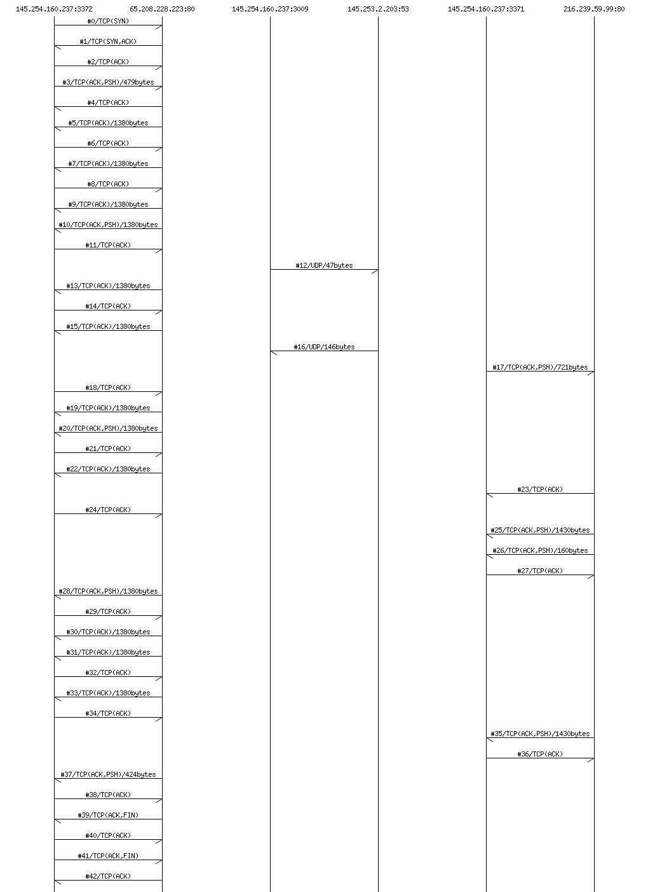

## Extracting MSC from PCAP

### Requirement

+ [Mscgen] http://www.mcternan.me.uk/mscgen/

### Sample script

[msc.js](msc.js) extracts MSC from PCAP file.

```javascript
// msc.js

// Variables
var width = 1024;
var nodes = [];
var edges = [];

// Utilities

function add_node(node) {
  for (var i=0; i<nodes.length; i++) {
    if (nodes[i] == node) {
      return i;
    }
  }
  nodes.push(node);
  return nodes.length;
}

function add_edge(src, dst, msg) {
  add_node(src);
  add_node(dst);
  edges.push([src, dst, msg]);
}


// Main functions

function BEGIN (version, scriptFile, pcapFile) {
  console.log("msc {");
  console.log("  width = \"" + width + "\";");
}

function END(count) {
  console.log("  \""+ nodes.join("\", \"") + "\";");

  for (i in edges) {
    src = edges[i][0];
    dst = edges[i][1];
    msg = edges[i][2];
    console.log("  \""+src+"\"", "->", "\""+dst+"\"", " [label = \"" + msg + "\"];");
  }

  console.log("}");
}

function TCP(n, ts, tcp, ip, eth) {
    var src = ipaddr(ip.SrcIP) + ":" + tcp.SrcPort;
    var dst = ipaddr(ip.DstIP) + ":" + tcp.DstPort;

    flags = [];
    if (tcp.SYN) {
	    flags.push("SYN");
    }
    if (tcp.ACK) {
	    flags.push("ACK");
    }
    if (tcp.PSH) {
	    flags.push("PSH");
    }
    if (tcp.FIN) {
	    flags.push("FIN");
    }

    var msg = "#"+n+ "/" + "TCP(" + flags.join(",") +")";
    if (tcp.Payload.length > 0) {
      msg = msg + "/" + tcp.Payload.length + "bytes";
    }

    add_edge(src, dst, msg);
}

function UDP(n, ts, udp, ip, eth) {
    var src = ipaddr(ip.SrcIP) + ":" + udp.SrcPort;
    var dst = ipaddr(ip.DstIP) + ":" + udp.DstPort;

    var msg = "#"+n+ "/" + "UDP";
    if (udp.Payload.length > 0) {
      msg = msg + "/" + udp.Payload.length + "bytes";
    }

    add_edge(src, dst, msg);
}

function ICMP(n, ts, icmp, ip, eth) {
    var src = ipaddr(ip.SrcIP);
    var dst = ipaddr(ip.DstIP);

    var msg = "#"+n+ "/" + "ICMP(" + icmp.TypeCode + ")";
    if (icmp.Payload.length > 0) {
      msg = msg + "/" + icmp.Payload.length + "bytes";
    }

    add_edge(src, dst, msg);
}

function IP(n, ts, ip, eth) {
    var src = ipaddr(ip.SrcIP);
    var dst = ipaddr(ip.DstIP);

    var msg = "#"+n+ "/" + "IP";
    if (ip.Payload.length > 0) {
      msg = msg + "/" + ip.Payload.length + "bytes";
    }

    add_edge(src, dst, msg);
}

function ARP(n, ts, arp, eth) {
    var src = ipaddr(ip.SrcIP);
    var dst = ipaddr(ip.DstIP);

    var msg = "#"+n+ "/" + "ARP(" + arp.Operation + ")";
    if (ip.Payload.length > 0) {
      msg = msg + "/" + arp.Payload.length + "bytes";
    }

    add_edge(src, dst, msg);
}

function Eth(n, ts, eth) {
    var src = hwaddr(eth.SrcMAC);
    var dst = hwaddr(eth.DstMAC);

    var msg = "#"+n+ "/" + "Ethernet";
    if (eth.Payload.length > 0) {
      msg = msg + "/" + eth.Payload.length + "bytes";
    }

    add_edge(src, dst, msg);
}
```

```
C:\work> pcapscript msc.js samples/http.pcap > msc.txt
C:\work> mscgen -Tpng -o msc.png msc.txt
```

msc.png :


